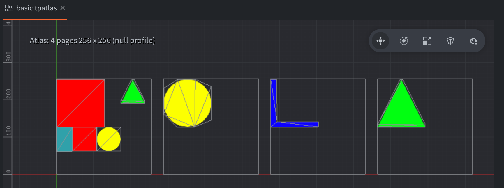

# Texture Packer Atlas support for Defold

Defold [native extension](https://www.defold.com/manuals/extensions/) for using packed atlases

[Manual, API and setup instructions](https://www.defold.com/extension-texturepacker/) is available on the official Defold site, or [here](./docs/index.md)

# The .tpinfo format is explained here

[.tpinfo format](./README_FORMAT.md)
