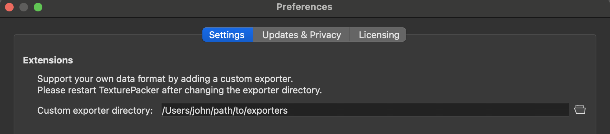
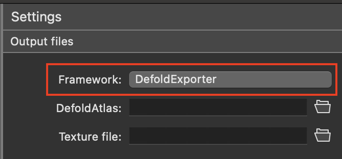
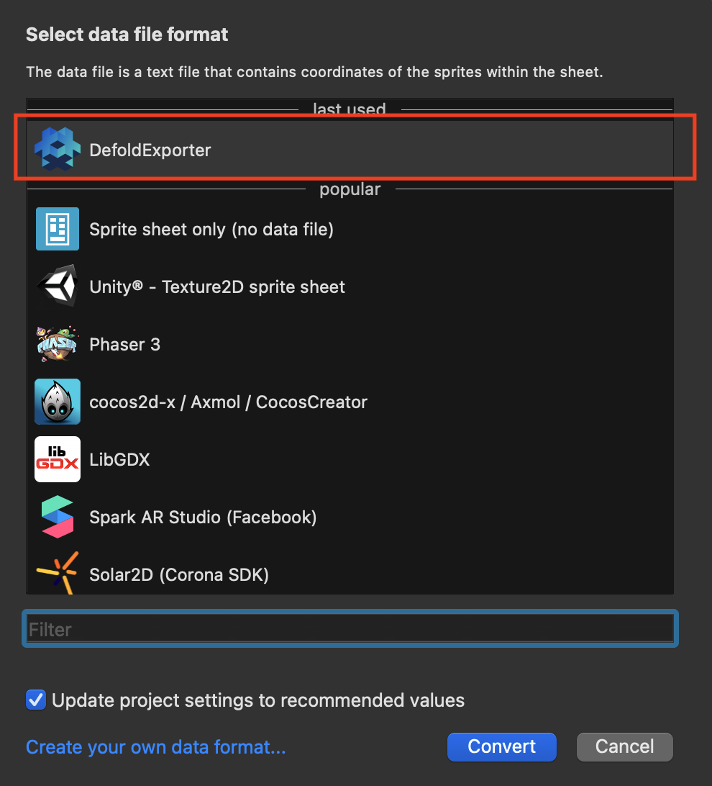
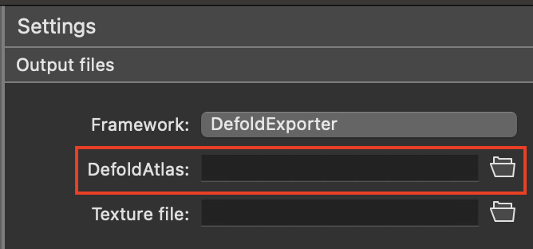
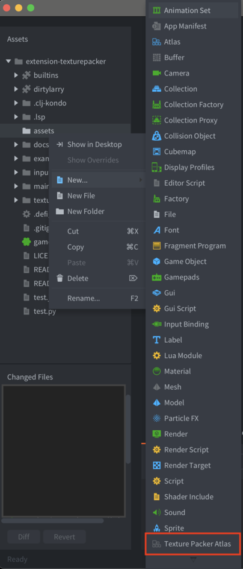
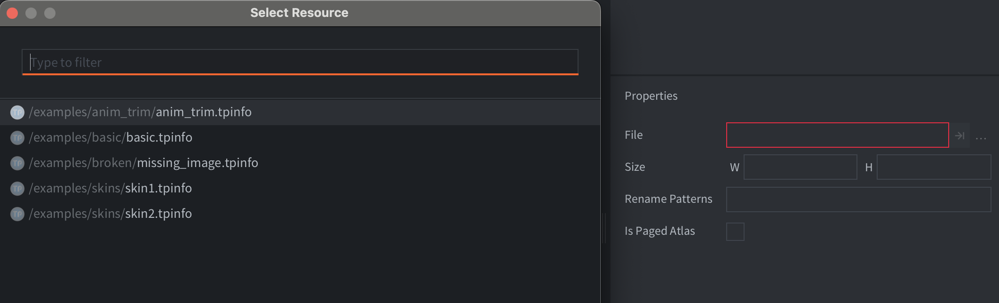

# TexturePacker

[TexturePacker](https://www.codeandweb.com/texturepacker) is an offline tool to create atlases.
It uses different strategies to pack images as tightly as possible into a larger atlas.

## Installation

Copy the folder `defoldexporter` from [./exporter](https://github.com/defold/extension-texturepacker/tree/main/exporter) to a location on your drive, e.g. `/Users/john/path/to/exporters/defoldexporter`

Then specify a the folder in Texture Packer like so:

## Export from Texture Packer

In Texture Packer, create a new project.
Next, press the `Framework` button:

It opens up the selection of exporters, choose `DefoldExporter`:

Next, choose a target file, by pressing the `DefoldAtlas` button:

Chose a location for your `.tpinfo` file.
The resulting exported `.png` files will end up next to this file.

## Import into Defold editor

In your Defold project, add a new file in the resource view. Choose `Texture Packer Atlas`, name it test, and you will now have a `test.tpatlas`.

In the final step, you can now hook up the `.tpinfo` exported file to your `.tpatlas` file:

## Properties

* `Rename Patterns` - Allows you to rename the source image ids. Useful when using multiple atlases with animations.

* `Is Paged Atlas` - If the `.tpinfo` has only one page (i.e. one .png), then you may choose if this file should generate a paged texture or not. Useful if you wish to use the atlas with a certain material. If the `.tpinfo` file has more than one page, it will always be exported as a paged texture.

## Animations

The overall functionality of a `.tpatlas` file is the same as a regular `.atlas` file.
You can define new animations, or use the single frame animations.

There are some differences:
* Single frame animations cannot be removed.
* You cannot add new images to the `.tpatlas` file.

In both cases, the workaround is to reexport the `.tpinfo` file from the Texture Packer tool.
